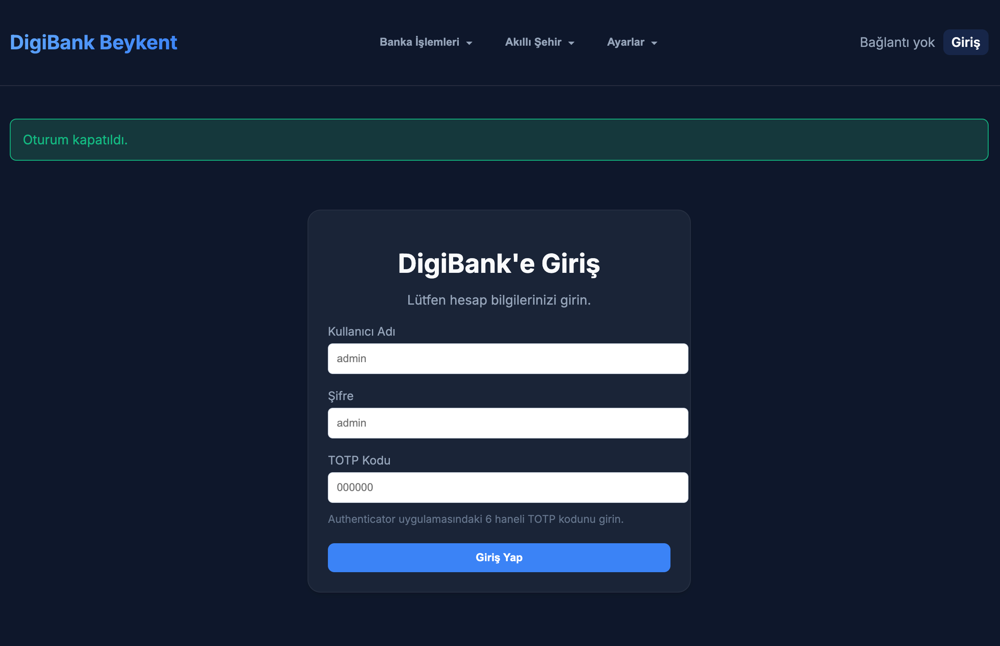
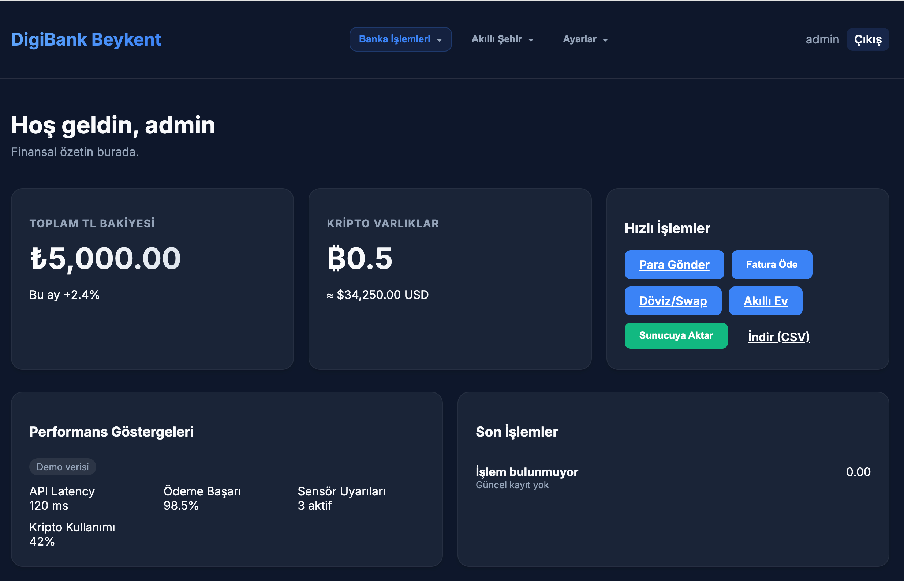
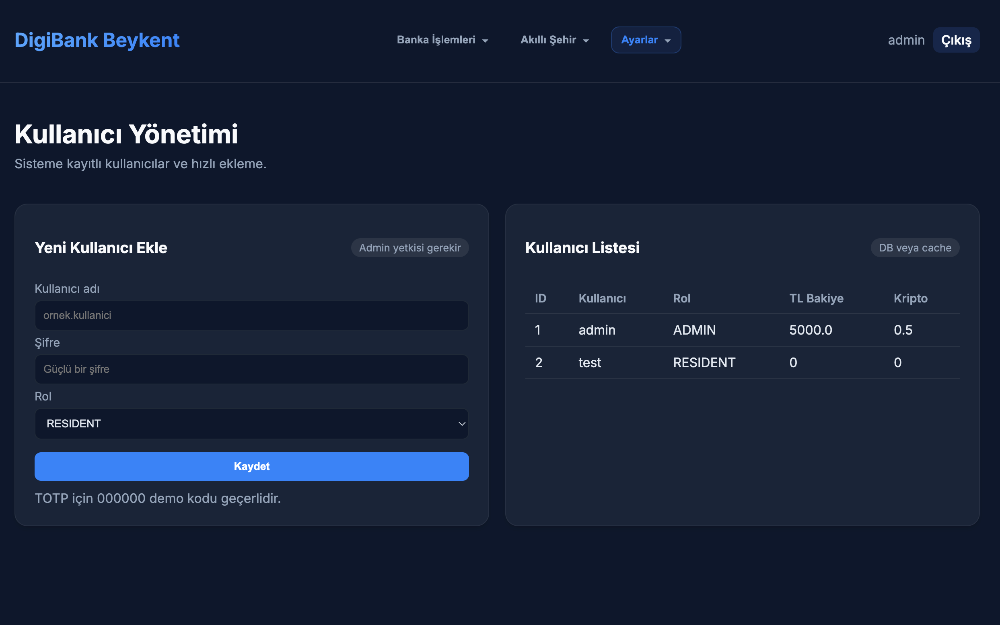
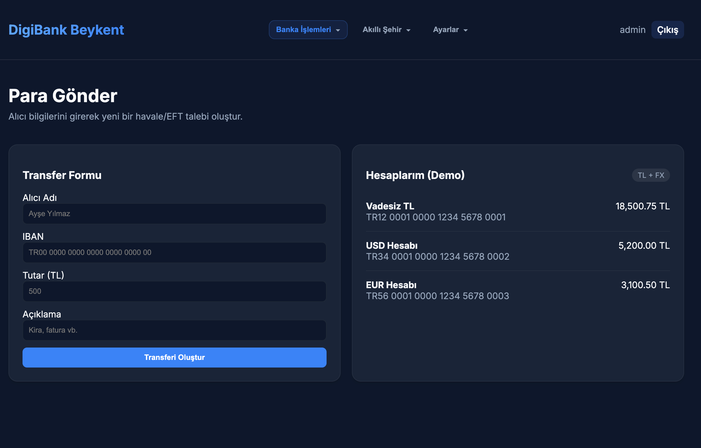

# DigiBank

**Kısa Açıklama**

DigiBank, bankacılık işlemlerini, ödeme entegrasyonlarını ve akıllı şehir/sürdürülebilirlik senaryolarını içeren örnek bir Java tabanlı proje ve basit bir Flask tabanlı yönetici/özellik arayüzü içerir. Proje, mikroservis/starter yapılandırmaları ve örnek desen uygulamaları (adapter, command, observer, vb.) barındırır.

---

## Referans Proje - Bankacılık Uygulaması 🏛️

Bu projenin bankacılık uygulaması, kök dizinde bulunan `digibank.exe` uygulamasından esinlenilerek ve referans alınarak geliştirilmiştir. Orijinal uygulama, temel bankacılık veri yönetimini (ekleme, silme, güncelleme, listeleme) sağlayan özgün bir masaüstü uygulamasıdır. Yeni web tabanlı uyarlamada, bu temel işlevler modern bir mikroservis mimarisine ve web arayüzüne taşınmıştır.

Referans uygulamanın ekran görüntülerinden bazıları:

<p align="center">
  
  &nbsp;&nbsp;
  
</p>


---

## Gereksinimler ✅

- Docker (Desktop veya Engine) yüklü olmalı
- Docker Compose (v2 tavsiye edilir) ya da `docker compose` komutu kullanılabilir
- macOS için: Docker Desktop kurulu olmalıdır

> Not: Projenin detaylı gereksinimleri ve mimari açıklaması için `docs/0_Steps.md` ve `docs/1_requirements.md` dosyalarına bakabilirsiniz.

---

## Hızlı Başlatma 🔧

1. Proje kök dizinine gidin:

```bash
cd /path/to/digibank
```

2. Konteynerleri oluşturup çalıştırın (önerilen):

```bash
docker compose up --build
```

Arka planda çalıştırmak için:

```bash
docker compose up -d --build
```

Kapatmak için:

```bash
docker compose down
```

Konteynerlerin loglarını takip etmek için:

```bash
docker compose logs -f
```

---

## Erişim ve Hizmetler 🌐

Docker Compose ile ayağa kalkan servislerin listesi ve erişim bilgileri aşağıdadır:

| Servis | URL / Port | Açıklama |
|---|---|---|
| **Frontend GUI** | [http://localhost:8000](http://localhost:8000) | Kullanıcı yönetimi ve özelliklerin test edildiği Flask tabanlı web arayüzü. |
| **Backend Java** | [http://localhost:8080](http://localhost:8080) | Ana Java uygulaması. API isteklerini karşılar ve iş mantığını yürütür. |
| **Mailpit** | [http://localhost:8025](http://localhost:8025) | Geliştirme ortamı için e-posta sunucusu. Gönderilen tüm e-postaları buradan görüntüleyebilirsiniz. |
| **PostgreSQL** | `localhost:5432` | Veritabanı sunucusu. `digibank` kullanıcısı ve şifresi ile erişilebilir. |


---

## Ekran Görüntüleri 🖼️

Aşağıda proje arayüzünden bazı görüntüler bulunmaktadır.

<p align="center">
  
  &nbsp;&nbsp;
  
  &nbsp;&nbsp;
  
</p>

<p align="center">
  
</p>

---

## Faydalı ipuçları / Sorun giderme 💡

- Eğer port çakışması varsa, ilgili portu kullanan başka servisleri durdurun veya `docker-compose.yml` içinden port atamasını değiştirin.
- Docker kaynak limitleri (özellikle macOS Docker Desktop) performansı etkileyebilir; gerekiyorsa ayarları güncelleyin.
- Daha fazla belge için `docs/` klasörünü inceleyin.

---

## Geliştirme ve katkı 🛠️

- Geliştirme sırasında konteynerleri yeniden oluşturmak için `--build` parametresini kullanın.
- Yeni özellik eklemeleri veya hata düzeltmeleri için lütfen proje dokümantasyonuna göz atın ve commit mesajlarını açıklayıcı yazın.

---
