# DigiBank & Smart City Entegrasyonu – Akademik Proje Raporu

**Öğrenci:** Ferdi Özaydın / 2420003042
**Ders:** Nesne Tabanlı Programlama
**Tarih:** 27.12.2025

---

## 1. Özet (Abstract)

Bu proje, geleneksel bankacılık işlemlerini modern "Akıllı Şehir" (Smart City) konseptleriyle birleştiren, güvenli ve ölçeklenebilir bir yazılım sistemi prototipidir. Çalışma iki ana evreden oluşmaktadır: ilk evrede referans alınan "digibank.exe" isimli konsol uygulaması analiz edilmiş, ikinci evrede ise bu referans sistem baz alınarak Java tabanlı güçlü bir REST API ve Python/Flask tabanlı modern bir web arayüzüne (DigiCityBank) evrilen özgün bir sistem geliştirilmiştir. Proje, Nesne Tabanlı Programlama (OOP) prensiplerini, yaygın Tasarım Kalıplarını (Design Patterns) ve modern güvenlik uygulamalarını (MFA, kriptografik hashing) pratik bir senaryoda göstermeyi amaçlar. Ayrıca Docker konteynerizasyonu, veritabanı entegrasyonu (PostgreSQL) ve e-posta simülasyonu (Mailpit) gibi endüstri standartları da projeye dahil edilmiştir.

## 2. Giriş (Introduction)

### 2.1. Problem Tanımı
Günümüzde bankacılık sistemleri sadece finansal transferlerden ibaret değildir. Dijitalleşen dünyada bankalar, kullanıcıların fatura ödemelerini, akıllı ev sistemlerini ve dijital varlıklarını (kripto vb.) tek bir merkezden yönettiği "süper uygulamalara" dönüşmektedir. Ancak bu entegrasyon, karmaşık mimari zorlukları ve güvenlik risklerini beraberinde getirmektedir.

### 2.2. Projenin Amacı
Bu projenin temel amacı;
1.  OOP prensiplerine uygun, genişletilebilir bir bankacılık altyapısı kurmak.
2.  Konsol tabanlı bir uygulamadan web tabanlı çok katmanlı mimariye geçişi simüle etmek.
3.  Design Pattern'lerin (Singleton, Strategy, Observer, vb.) gerçek hayat problemlerini (ödeme yöntemleri, olay takibi) çözmekte nasıl kullanıldığını göstermektir.

## 3. Sistem Tasarımı ve Metodoloji

### 3.1. Yazılım Mimarisi
Sistem, modern mikroservis yaklaşımlarına benzer şekilde dağıtık bileşenlerden oluşur:

*   **Backend (Sunucu Katmanı):** Java 17 kullanılarak geliştirilmiştir. Harici bir framework yerine gömülü `HttpServer` kullanılarak native HTTP işleme yeteneği sergilenmiştir. Tüm iş mantığı, veritabanı bağlantıları ve güvenlik kontrolleri burada yönetilir.
*   **Frontend (İstemci Katmanı):** Python Flask framework'ü ile geliştirilen web arayüzüdür. Kullanıcı dostu ekranlar sunar ve Java Backend ile REST API üzerinden haberleşir.
*   **Veritabanı:** Veri kalıcılığı için PostgreSQL kullanılmıştır. Kullanıcılar ve finansal işlemler burada tutulur.
*   **Yan Servisler:** E-posta testleri için Mailpit SMTP sunucusu kullanılmıştır.

### 3.2. Kullanılan Tasarım Kalıpları
*   **Singleton:** `AuditLogger` sınıfı ile tüm sistemde tek bir loglama mekanizması garanti edilmiştir.
*   **Strategy:** `PaymentStrategy` arayüzü sayesinde FIAT para veya Kripto para ile ödeme yapma esnekliği sağlanmıştır (Open/Closed Principle).
*   **Adapter:** Dış sistemleri simüle eden kripto servisleri için `CryptoAdapter` kullanılmıştır.
*   **Observer:** Akıllı ev ve sensör verilerindeki değişimleri izlemek için kullanılmıştır.
*   **Command:** Yönetici komutları ve ev otomasyon komutları nesneleştirilerek kuyruğa alınabilir hale getirilmiştir.

### 3.3. Güvenlik
*   SHA3-512 algoritması ve "Salt" kullanımı ile parolalar güvenli şekilde saklanmaktadır.
*   Zaman tabanlı tek kullanımlık şifre (TOTP) ile İki Faktörlü Kimlik Doğrulama (MFA) uygulanmıştır.
*   Rol bazlı yetkilendirme (Admin vs Standart Kullanıcı) mevcuttur.

---

## 4. Kullanıcı Arayüzleri ve Uygulama Görüntüleri

Projenin evrimini göstermek adına, hem ilk versiyon olan konsol uygulaması hem de nihai web uygulaması aşağıda sunulmuştur.

### 4.1. Bölüm 1: DigiBank Konsol Uygulaması (Referans Proje)
Bu projenin geliştirilmesinde temel alınan ve referans noktası olarak kullanılan `digibank.exe` konsol arayüzü, temel CRUD işlemlerini C++ standartlarında gerçekleştirmektedir. Bu uygulama tarafımızca geliştirilmemiş olup, modern sisteme geçişte analiz ve kıyaslama amacıyla kullanılmıştır.

**1. Ana Menü ve Giriş**
Kullanıcıyı karşılayan ana menü, tüm operasyonlara (Ekleme, Silme, Listeleme vb.) erişim sağlar. Basit ve hızlı bir metin arayüzüdür.
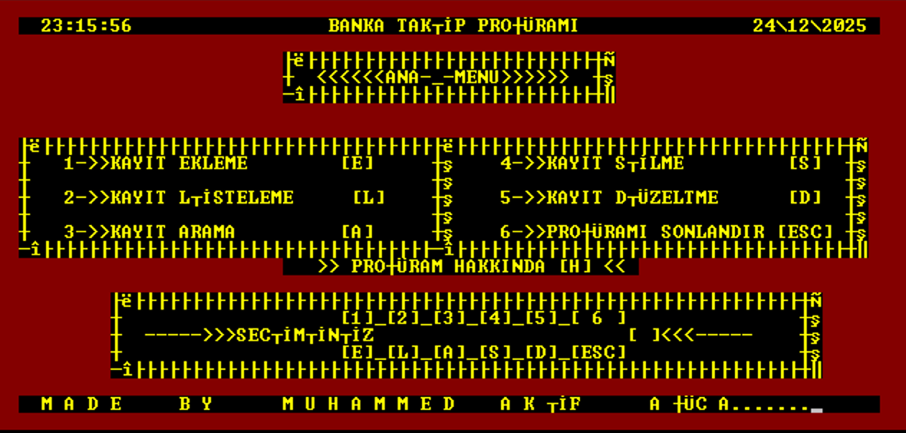

**2. Veri Ekleme (Add)**
Yeni bir banka veya müşteri kaydı oluşturmak için kullanılan ekran. Kullanıcıdan adım adım veriler istenir.
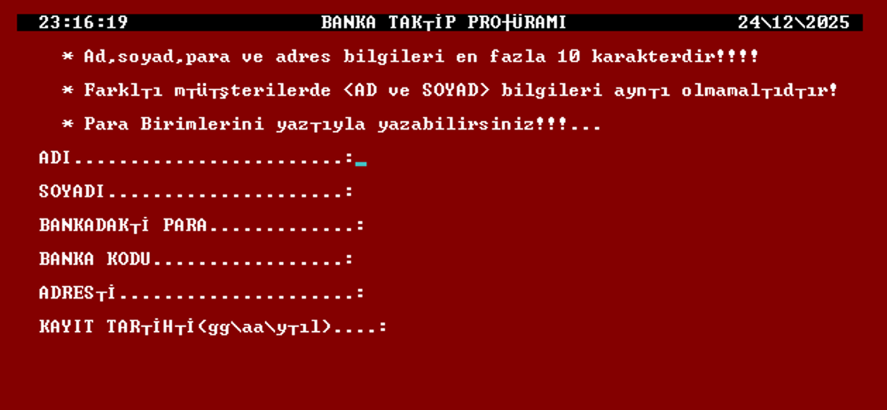

**3. Veri Listeleme (List)**
Sistemde kayıtlı olan tüm verilerin tablo benzeri bir yapıda listelendiği ekrandır.
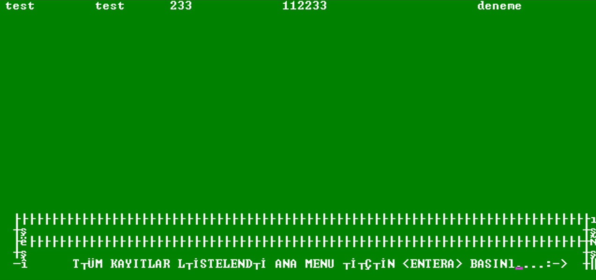

**4. Arama İşlemi (Search)**
Belirli kriterlere göre (örn: İsim) kayıtlar arasında arama yapılmasını sağlar.
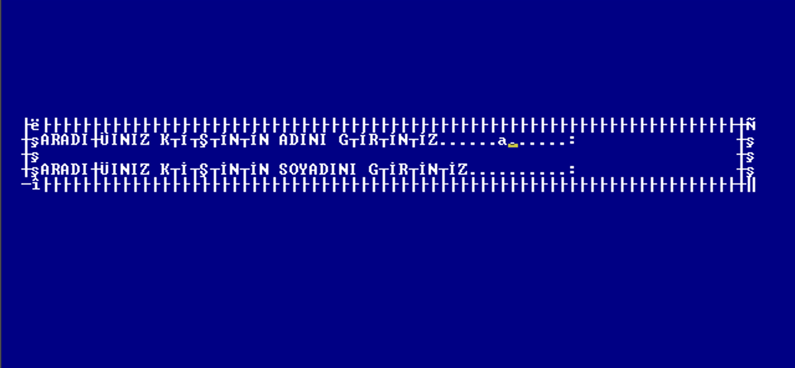

**5. Kayıt Düzenleme (Update)**
Mevcut bir kaydın bilgilerini güncellemek için kullanılan ekrandır. ID seçimi sonrası yeni veriler girilir.
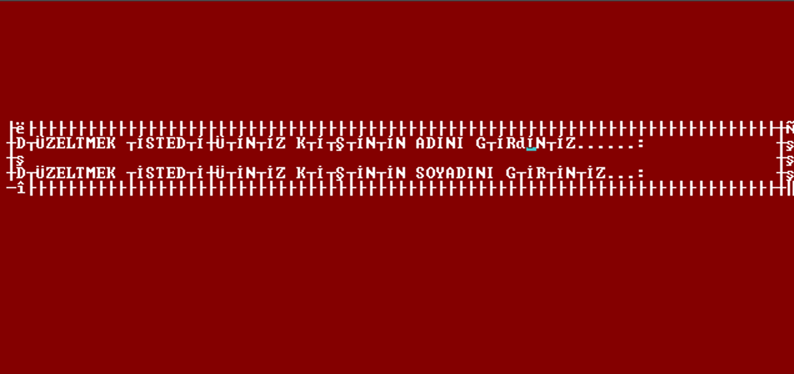

**6. Kayıt Silme (Delete)**
Veritabanından bir kaydın güvenli şekilde silinmesi işlemidir.

---

### 4.2. Bölüm 2: DigiCityBank Web Platformu (Modern)
Projenin modern yüzü olan DigiCityBank, tarayıcı tabanlı, responsive ve görsel olarak zenginleştirilmiş bir deneyim sunar.

**1. Güvenli Giriş Ekranı (Login)**
Kullanıcı adı ve parola ile giriş yapılır. Arka planda MFA kontrolü ve güvenli oturum token'ı (JWT benzeri) üretimi gerçekleşir.
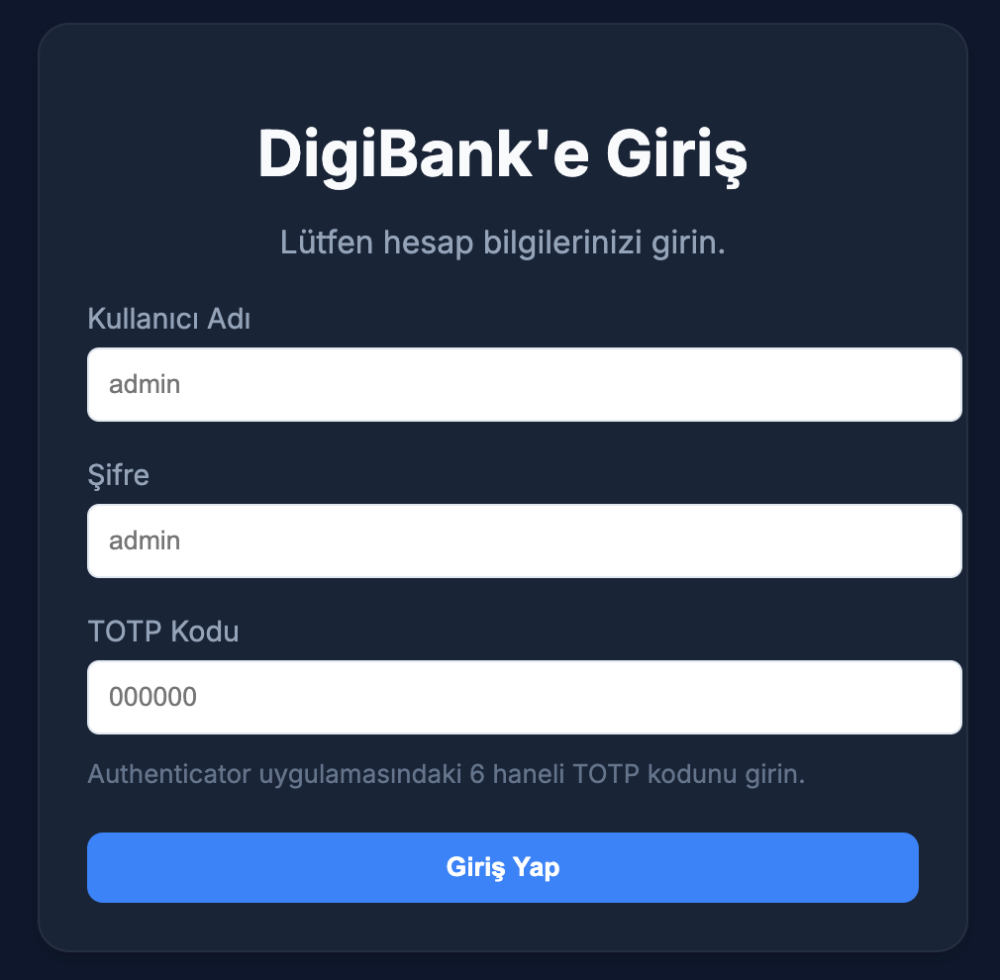

**2. Yönetim Paneli (Dashboard)**
Kullanıcının bakiyelerini, aktif kartlarını ve son işlemlerini özet olarak görebildiği ana ekrandır.
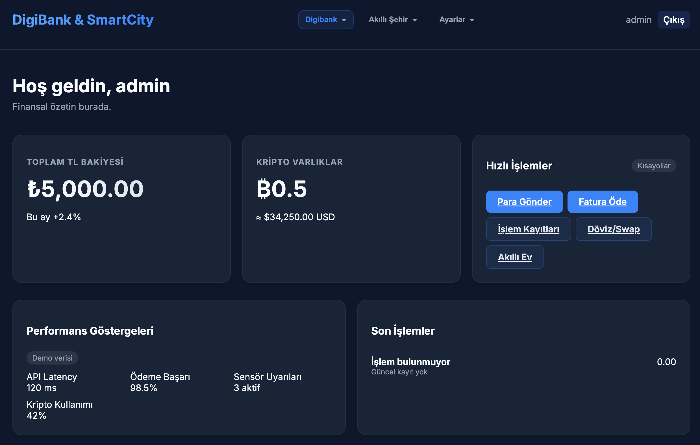

**3. Performans ve Analitik**
Sistemin işlem hacmini, finansal tahminleri (Forecast) ve sunucu metriklerini görsel grafiklerle sunan yönetici ekranıdır.
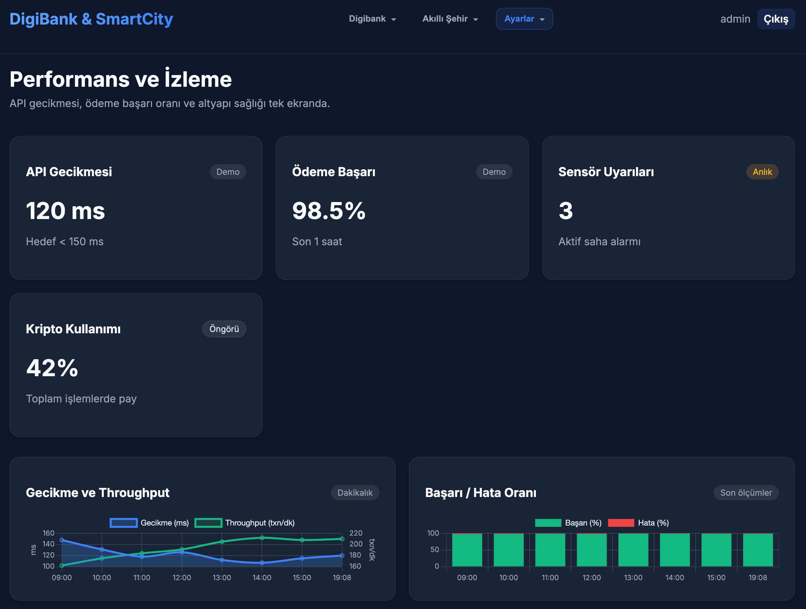

**4. Akıllı Şehir (Smart Government) Ödemeleri**
Su, elektrik, doğalgaz gibi faturaların ödendiği modüldür. Kullanıcı mevcut bakiyesinden anında ödeme yapabilir.
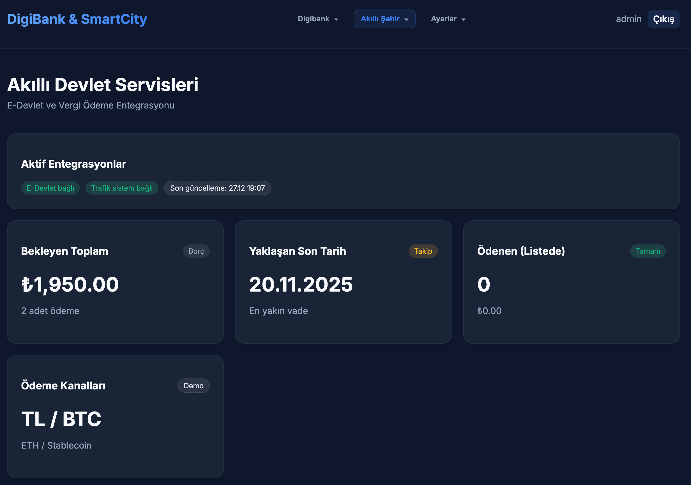

**5. Para Transferi**
Başka bir hesaba IBAN veya Hesap No üzerinden para transferi işlemini simüle eden arayüzdür.

**6. Akıllı Ev (Smart Home) Kontrolü**
Bankacılık uygulaması içinden entegre ev cihazlarının (termostat, ışıklar vb.) kontrol edildiği IoT modülüdür. Observer pattern burada aktiftir.
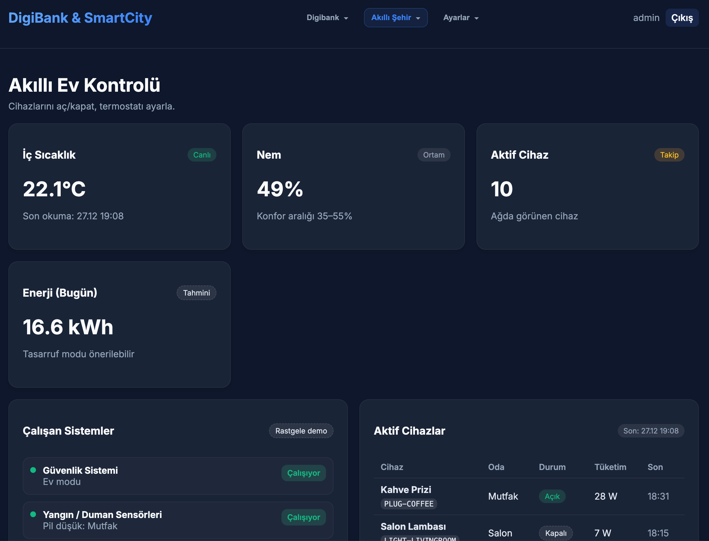

**7. Yönetici: Kullanıcı Listesi**
Sistem yöneticilerinin (Admin) kullanıcıları görebildiği, rollerini değiştirebildiği yönetim ekranıdır.
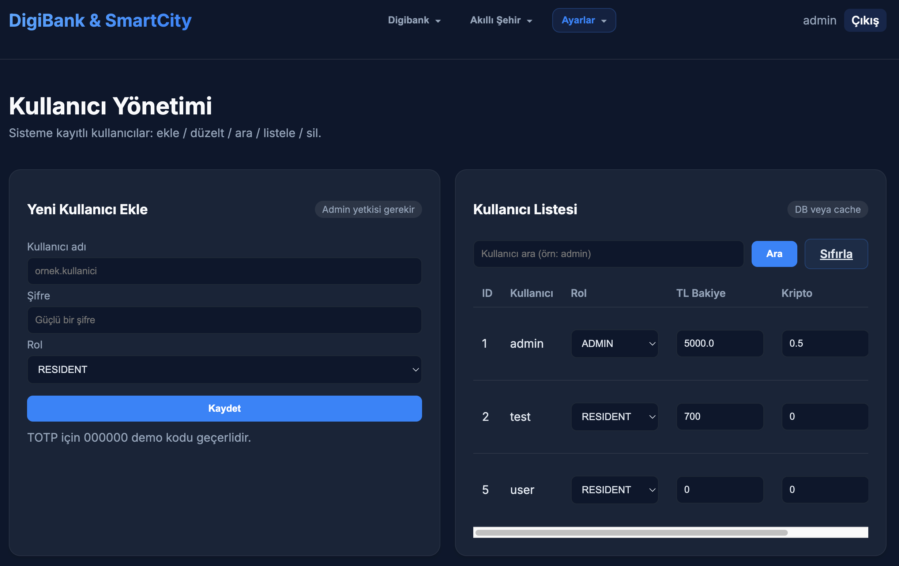

**8. Yönetici: Finansal İşlemler**
Gerçekleşen tüm para transferlerinin ve ödemelerin dökümünün alındığı, audit amaçlı ekrandır.
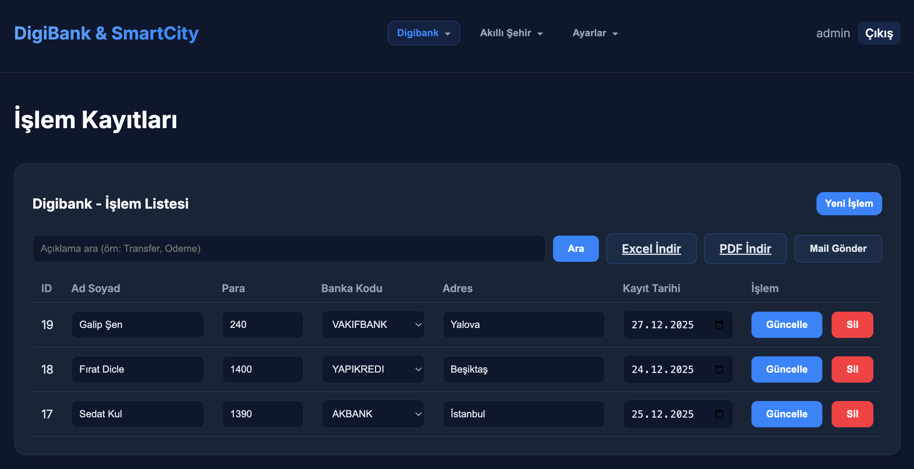

**9. Excel Raporlama**
Finansal işlemlerin muhasebeleşmesi için Excel (XLSX) formatında dışa aktarılmasını sağlayan özelliktir.
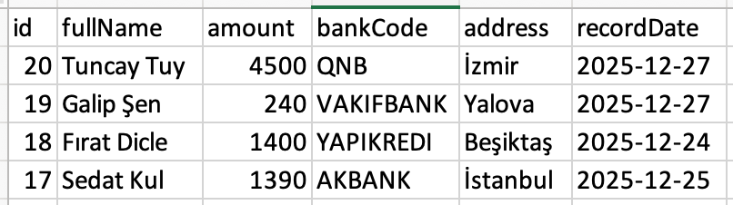

**10. E-Posta Servisi Entegrasyonu (Mailpit)**
Bankacılık sisteminden gönderilen dekont ve bildirimlerin, simüle edilmiş SMTP sunucusu (Mailpit) üzerindeki görüntüsü.
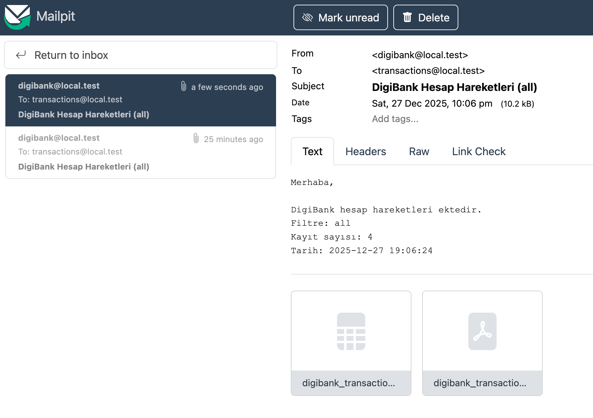

**11. Başarılı İşlem Bildirimi**
Bir işlem sonrası kullanıcıya e-posta gönderildiğine dair web arayüzündeki geri bildirim.
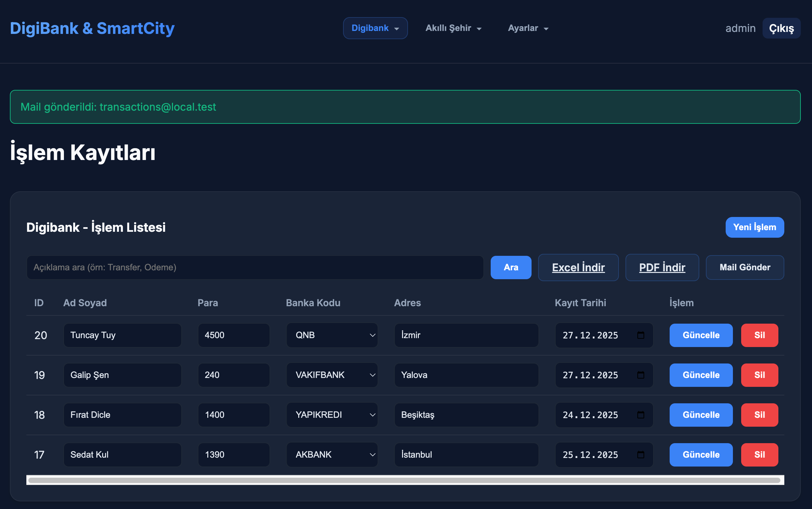

---

## 5. Sonuç ve Değerlendirme

Bu proje kapsamında, basit bir veri giriş uygulamasından başlayarak, çok katmanlı, güvenli ve modern bir finansal teknoloji (FinTech) uygulamasına giden süreç başarıyla tamamlanmıştır.

**Elde Edilen Kazanımlar:**
1.  **Tam Yığın Geliştirme:** Hem backend (Java) hem frontend (Python) hem de veritabanı (SQL) entegrasyonu sağlanmıştır.
2.  **Tasarım Kalıpları:** Teorik bilgilerin (Observer, Singleton, Strategy vb.) pratikte kodun yönetilebilirliğini ve esnekliğini nasıl artırdığı görülmüştür.
3.  **Endüstriyel Araçlar:** Docker ile dağıtım kolaylığı ve Mailpit gibi test araçlarının entegrasyonu deneyimlenmiştir.

DigiCityBank, akademik bir ödevin ötesinde, gerçek dünya senaryolarını simüle eden kapsamlı bir yazılım mimarisi örneğidir.

## 6. Ekler

*   **Kaynak Kodlar:** GitHub Reposu / Proje Klasörü
*   **Database Şeması:** `docs/ek_a_database_schema.mmd`
*   **UML Diyagramları:** `docs/2_uml_class.mmd`
*   **Kurulum Adımları:** `docs/0_Steps.md`
